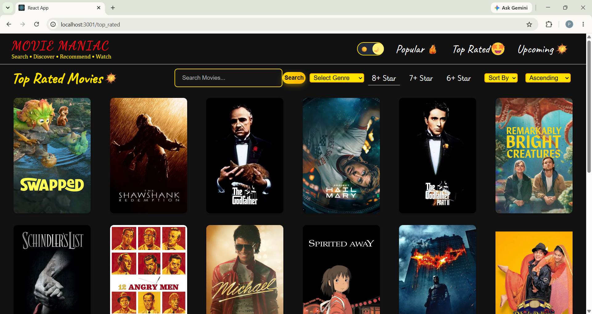

# 🎬 Movie Maniac - Movie Recommendation App

A modern React-based movie browsing and recommendation web app where users can explore **Popular**, **Top Rated**, and **Upcoming** movies with a clean UI and dark/light mode support.

---

## 🚀 Features

- Browse Popular Movies
- View Top Rated Movies
- Check Upcoming Movies
- Dark / Light Mode Toggle
- Movie filtering & recommendation system
- Fast and responsive UI
- Clean and modern design

---

## 🛠️ Tech Stack

- React.js (Frontend framework)
- React Router DOM (Navigation)
- CSS3 (Styling)
- Lodash (Utility functions)
- Movie API (TMDB used)

---

## 📷 Project Preview

### Main Interface



---

## 📁 Project Structure

```text
MovieRecommendationApp/
├── node_modules/
├── public/
├── src/
│ ├── assets/
│ │ ├── blast.png
│ │ ├── fire.png
│ │ ├── happy.png
│ │ └── smiley.png
│ │
│ ├── components/
│ │ ├── Moviecards.js
│ │ ├── Moviecards.css
│ │ ├── Moviefilteritems.js
│ │ ├── Moviefilteritems.css
│ │ ├── Movielist.js
│ │ ├── Movielist.css
│ │ ├── Navbar.js
│ │ ├── Navbar.css
│ │ ├── Togglebutton.js
│ │ └── Togglebutton.css
│ │
│ ├── App.js
│ ├── App.css
│ ├── index.js
│ ├── index.css
│ ├── reportWebVitals.js
│ └── App.test.js
│
├── .gitignore
├── package.json
├── package-lock.json
└── README.md

```

---

# Author

Done by Meghana Palavalasa
